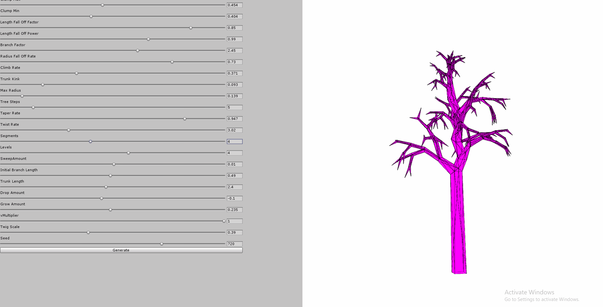

# Proctree-for-Unity
A port of proctree.js for use in the Unity engine.

## How to use
Included in the .unitypackage is the translated version of the library from [GitHub](https://github.com/supereggbert/proctree.js) into C#.
Bear in mind this does not yet include full functionality - only verts and triangles have been implemented.
In addition to the translated library is an editor script that allowes you to change specific variables and view effects of generation. 

